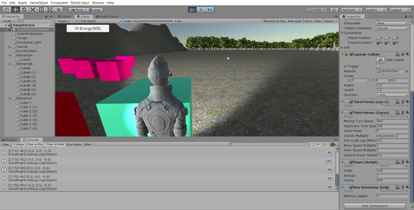
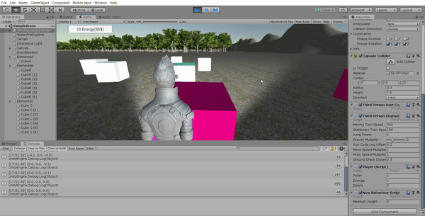

# EVALUACIÓN INDIVIDUAL

## Funcionamiento de los scripts

### Disparo a objeto de tipo A y GUI de compra de energía

En los atributos públicos del script visibles en la esquina inferior derecha se puede ver como, al comprar energía, aumenta la energía y disminuye el dinero.

También se puede comprobar que cuando aumenta la energía, el objeto de tipo A disminuye más cuando se dispara

### Disparo a objeto de tipo B

En los atributos públicos del script visibles en la esquina inferior derecha se puede ver como, al disparar al objeto de tipo B, aumenta el dinero del jugador

### Movimiento de objetos C por empuje de objetos B

En los atributos públicos del script visibles en la esquina inferior derecha se puede ver como, al aumentar el poder, la fuerza con la que se mueven los cubos de tipo C es mayor

