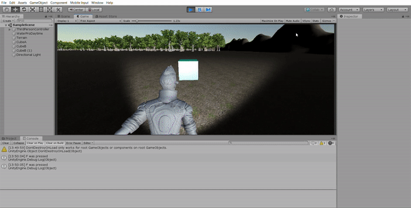
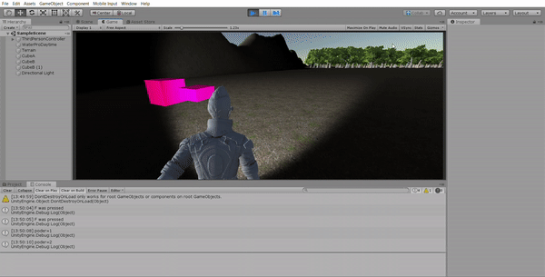
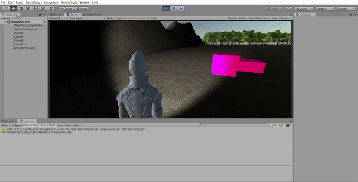

# DELEGADOS Y EVENTOS

## OBJETO TIPO A

El objeto de tipo A ejecuta el evento CollisionA de GameController cuando el jugador collisiona con él y esto hace que el poder del jugador aumente

## OBJETO TIPO B

El objeto de tipo B ejecuta el evento CollisionB de GameController cuando el jugador collisiona con él y esto hace que el poder del jugador disminuya y el objeto cambie su forma

## LUZ

La iluminación ejecuta el evento Switch de GameController cuando el usuario presiona la tecla "F" que hace que se encienda y apage la luz

