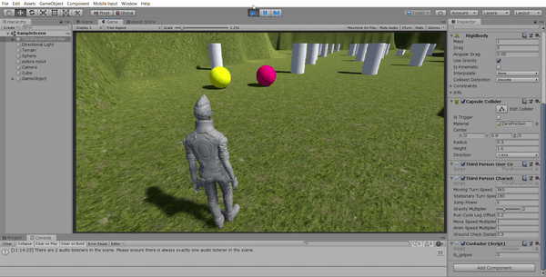
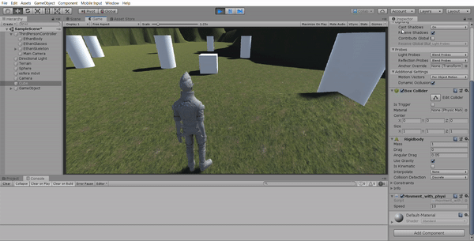

# Físicas con Unity

## Scripts en funcionamiento

### Colisiones con esferas

En la esquina inferior derecha se puede ver como aumenta el número de colisiones cada vez que el jugador colisiona con una esferas
 

### Colisiones con cilindros

Dependiendo del tipo de objeto que colisione con la esfera la esfera adopta distintos colores en las tres etapas de la colisión

### Movimiento del cubo con físicas

